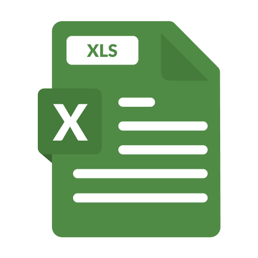
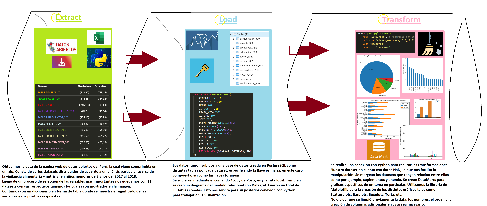
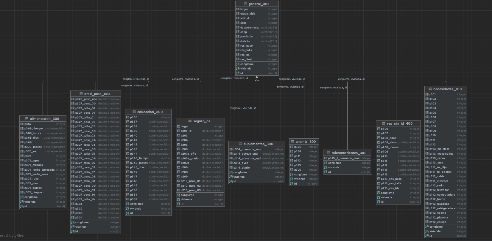
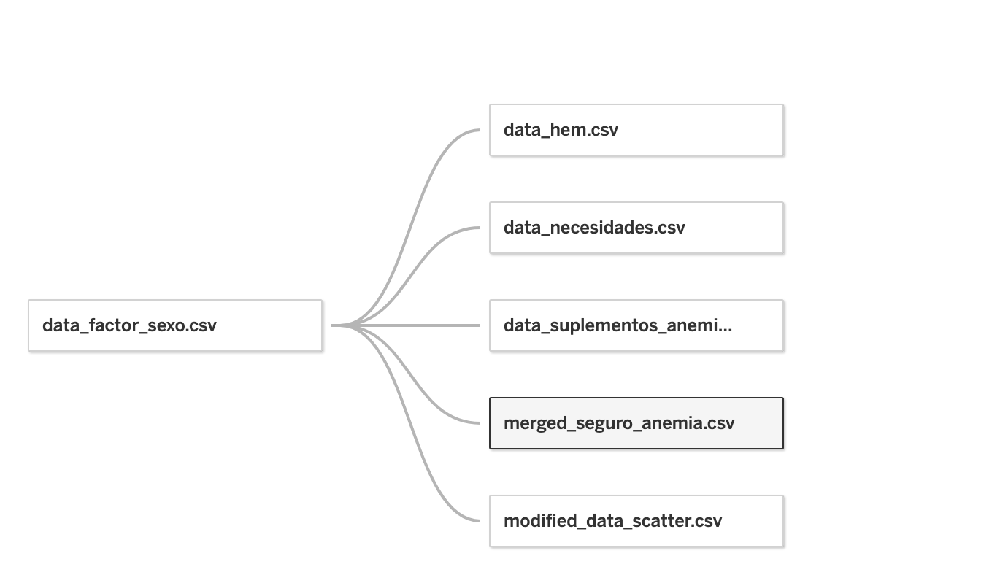

# Proyecto Final: Perú, Estado Nutricional Infantil.

- Oscar Chu

- Camila Rodriguez.

---
# 1. Identificación del Problema

## Contexto 

Durante los años 2017 y 2018, se llevó a cabo la encuesta VIANEV (Vigilancia Alimentaria Nutricional por Etapas de Vida) en todo el territorio de Perú. Esta encuesta fue realizada tanto en zonas urbanas como rurales, específicamente en hogares con niños menores de 3 años.

## Naturaleza de los datos

Los datos fueron recopilados mediante encuestas en dos fases: 
- Primera fase: del 16 de octubre al 28 de diciembre de 2017.
- Segunda fase: del 26 de febrero al 13 de mayo de 2018.

Estas encuestas estuvieron a cargo de la Dirección Ejecutiva de Vigilancia Alimentaria y Nutricional - Centro Nacional de Alimentación y Nutrición – Instituto Nacional de Salud (CENAN - INS). El objetivo principal de esta encuesta era describir el estado nutricional de los niños menores de 3 años en Perú.

Las encuestas fueron conducidas por equipos compuestos por un supervisor de equipo, dos encuestadores nutricionistas, un encuestador bioquímico, cuatro profesionales para control de calidad, un jefe de campo, un apoyo administrativo y el equipo técnico de VIANEV compuesto por seis personas.

Tras la recolección de los datos, se digitalizaron y verificaron en la interfaz de CENAN. Se realizaron controles de calidad para garantizar la consistencia de los datos, como la verificación de las fechas de nacimiento y que los sujetos de estudio cumplieran con el rango de edad establecido (menores de 35 meses), entre otros aspectos.

Finalmente, los datos fueron publicados y están disponibles en: https://www.datosabiertos.gob.pe/dataset/encuesta-vianev-2017-2018-estado-nutricional-en-ni%C3%B1os-menores-de-3-a%C3%B1os-ins-cenan.

El archivo descargado en formato ZIP contiene la siguiente estructura:

- Bases: 12 archivos Excel representando la base de datos titulada "CAP"+ 3 dígitos.
- Factor: Base de datos que presenta datos generales de las encuestas VIANEV y códigos de diferenciación. No se dispone de un diccionario para esta base de datos.
- Diccionarios: 12 archivos Excel que proporcionan interpretaciones a las columnas de las relaciones en las bases de datos mencionadas anteriormente.

## Potencial e importancia del análisis a realizar

A diferencia de años anteriores, no se publicó un informe técnico con los resultados de la encuesta. Por tanto, surge la necesidad de realizar un análisis de los datos recolectados, con el objetivo de poner a disposición del público esta información. Si bien el objetivo original era describir el estado nutricional de los niños menores de 3 años, consideramos importante dar un enfoque adicional y concentrarse en los subgrupos de la población estudiada y en particular en la lucha contra la anemia, un problema de salud grave que afecta a un gran porcentaje de la población infantil en Perú.

## Potenciales usuarios

El análisis de estos datos será de interés para el INS, la comunidad científica y el público en general interesado en conocer las relaciones entre las condiciones sociales, geográficas, de género, educativas y culturales de los niños y su estado nutricional. Especialmente relevante es la relación entre estos factores y la incidencia de la anemia en esta población.

## 2. Data Pipeline

### **Extract**

El dataset elegido consta de varios sub datasets que muestran la encuesta de Vigilancia Alimentaria y Nutricional en niños menores de 3 años en un periodo que consta de 2 fases, primera fase: 16 de octubre al 28 diciembre de 2017 Segunda fase: 26 de febrero al 13 de mayo de 2018. Su cobertura abarca todo el Perú y por dominios de residencia (Lima Metropolitana, zona urbana y rural). 
Esta data fue extraída de la página web de datos abierto del gobierno peruano de manera de descarga en formato .zip, diseñada para comunidad científica y público general.

[Datos Abiertos Dataset Link](https://www.datosabiertos.gob.pe/dataset/encuesta-vianev-2017-2018-estado-nutricional-en-ni%C3%B1os-menores-de-3-a%C3%B1os-ins-cenan)

## Diccionario de los datasets

### TABLE GENERAL_001:
| Variable | Significado | Opciones |
|:------------- |:---------------:| :---------------:
| CONGLOME INT         | Conglomerado        |  |
| VIVIENDA INT         | Vivienda        | |
| HOGAR INT         | Hogar          | |
| ID CHAR(4)         | ID del niño         | |
| ETAPA_VIDA INT         | Etapa de vida           |1: Niño   2: Adolescente   3: Adulto Mayor |
| ALTITUD INT         | Altitud (msnm)         | 
| SEXO INT         | Sexo          | 1: Masculino   2: Femenino
| DEPARTAMENTO VARCHAR(255)         | Departamento          | 
| CCPP VARCHAR(255)         | Centro Poblado         | 
| PROVINCIA VARCHAR(255)         | Provincia         | 
|  DISTRITO VARCHAR(255) | Distrito |
| RES_PESO INT        | Resultado del Peso           | 1: Completo  2: Ausente  3: Rechazo  4: No incluido
| RES_TALLA INT         | Resultado de la Talla         | 1: Completo  2: Ausente  3: Rechazo  4: No incluido
| RES_HB INT         | Resultado de la Hemoglobina          | 1: Completo  2: Ausente  3: Rechazo  4: No incluido
| RES_FINAL INT         | Resultado Final Encuesta Niño          | 1: Completa  2: Incompleta  3: Rechazo  4: Ausente  5: No se inicio entrevista  6: Otro
| PRIMARY KEY         | (CONGLOME, VIVIENDA, ID)          | 

### NECESIDADES_100:

| Variable | Significado | Opciones |
|:------------- |:---------------:| :---------------:
| CONGLOME INT         | Conglomerado        |  |
| VIVIENDA INT         | Vivienda        | |
| ID CHAR(4)         | ID del niño         | |
| P101 INT        | Tipo de vivienda           |1: Casa independiente  2: Departamento en edificio  3: Vivienda en quinta  4: Vivienda en casa de vecindad (callejón, solar o corralón)  5: Choza o cabaña  6: Vivienda improvisada  7: Local no destinado para habitación humana  8: Otro |
| P102 INT         | ¿Cuál es el material predominante en paredes exteriores?         | 1: Ladrillo o bloque de cemento  2: Piedra o sillar con cal o cemento  3: Adobe o tapia  4: Quincha (caña con barro)  5: Piedra con barro  6: Madera  7: Estera  8: Otro  9: Ninguno
| P103 INT         | ¿Cuál es el material predominante en los techos de su vivienda? | 1: Concreto armado  2: Madera  3: Tejas  4: Planchas de calamina  fibra de cemento o similares  5: Caña o esteras con tortas de barro  6: Esteras  7: Pajas, hojas de palmeras, etc.  8: Cartón, plástico, tela  9: Otro
| P104 INT        | ¿Cuál es el material predominante de los pisos de su vivienda? | 1: Parquet o madera pulida  2: Láminas asfálticas, vinílicos o similares  3: Losetas, terrazos o similares  4: Madera (entablados)  5: Cemento / Falso piso   6: Tierra / Arena / Ripio  7: Otro
| P105 INT        | El abastecimiento de agua en su hogar habitualmente procede de: | 1: Red pública dentro de la vivienda  2: Red pública fuera de la vivienda  3: Pilón / Grifo público  4: Pozo  5: Río / Acequia / Manantial  6: Camión tanque / Aguatero  7: Otro
| P106 INT         | El servicio higiénico de su hogar está conectado a: | 1: Red pública dentro de la vivienda  2: Red pública fuera de la vivienda  3: Pozo séptico  4: Letrina (bajo pautas técnicas)  5: Pozo ciego o negro / Silo (orificio simple)  6: Río, acequia o canal  7: Otro
| P107 INT |  ¿Qué tipo de alumbrado tiene su hogar? | 1: Electricidad  2: Gas licuado (GLP)  3: Gas natural (tubería)  4: Kerosone  5: Vela  6: Batería  7: Otro
| P108 INT        | Sin contar baño, cocina, pasadizos, ni garaje ¿Cuántas habitaciones son de uso de su hogar? | 
| P109 INT         | ¿Cuántas habitaciones usan en su hogar para dormir? | 
| P110 INT        | ¿Cuál es el combustible que utilizan más frecuentemente en su hogar para cocinar? | 1: Electricidad  2: Gas licuado (GLP)  3: Gas natural (tubería)  4: Kerosone  5: Carbón  6: Leña  7: Paja / Arbusto / Hierba  8: Bosta (estiércol de animal)  9: Otro  10: No cocina
| P111 INT         | ¿Tiene en su hogar: Teléfono fijo, teléfono celular, cable, etc.? | 1: Sí  2: No  3: NS
| P112 INT         | ¿Tiene en su hogar: Radio, televisor a color, computadora, etc.? | 1: Sí  2: No  3: NS
| P113_BICICLETA INT         | ¿Algún miembro de su hogar tiene bicicleta / triciclo? | 1: Sí  2: No  3: NS
|P113_MOTOCICLETA INT        | ¿Algún miembro de su hogar tiene motocicleta? | 1: Sí  2: No  3: NS
|P113_P113_CARRO INT       | ¿Algún miembro de su hogar tiene carro?| 1: Sí  2: No  3: NS
|P113_OTRO INT        | ¿Algún miembro de su hogar tiene otro medio de transporte?| 1: Sí  2: No  3: NS
|P111_TEL_FIJO INT       | ¿Tiene en su hogar: Teléfono fijo?| 1: Sí  2: No  3: NS
|P111_TEL_CELULAR INT        | ¿Tiene en su hogar: Teléfono celular?| 1: Sí  2: No  3: NS
|P111_CABLE INT        | ¿Tiene en su hogar: Cable?| 1: Sí  2: No  3: NS
|P111_INTERNET INT       | ¿Tiene en su hogar: Internet?| 1: Sí  2: No  3: NS
| P112_RADIO INT      | ¿Tiene en su hogar: Radio?| 1: Sí  2: No  3: NS
|P112_TELEVISOR INT      | ¿Tiene en su hogar: Televisor a color?| 1: Sí  2: No  3: NS
|P112_COMPUTADORA INT       | ¿Tiene en su hogar: Computadora?| 1: Sí  2: No  3: NS
|P112_HORNO INT       | ¿Tiene en su hogar: Horno microondas?| 1: Sí  2: No  3: NS
|P112_LAVADORA INT       | ¿Tiene en su hogar: Lavadora?| 1: Sí  2: No  3: NS
|P112_COCINA INT     | ¿Tiene en su hogar: Cocina a gas?| 1: Sí  2: No  3: NS
|P112_PLANCHA INT     | ¿Tiene en su hogar: Plancha?| 1: Sí  2: No  3: NS
|P112_EQUIPO INT      | ¿Tiene en su hogar: Equipo de música?| 1: Sí  2: No  3: NS
| PRIMARY KEY         | (CONGLOME, VIVIENDA, ID)          | 
| FOREIGN KEY         | (CONGLOME, VIVIENDA, ID) REFERENCES GENERAL_001 (CONGLOME, VIVIENDA, ID)       | 

### TABLE SEGURO_PS:

| Variable | Significado | Opciones |
|:------------- |:---------------:| :---------------:
| CONGLOME INT         | Conglomerado        |  |
| VIVIENDA INT         | Vivienda        | |
| ID CHAR(4)         | ID del niño         | |
| P209 FLOAT        | Seguro de salud           |1: EsSalud  2: FFAA  3: SIS  4: Entidad Prestadora Salud EPS  5: Seguro Privado  6: No tiene  7: NS/NR
| P210_PSOC_01 FLOAT        | Programas Sociales 1        | 1: Cuna Más  2: Vaso de leche  3: Qali Warma  4: Juntos  5: Pensión 65  6: Vuelve a sonreir  7: Tayta Wasi  8: Otros programas  9: Ninguno  10: NS/NR
| PRIMARY KEY         | (CONGLOME, VIVIENDA, ID)          | 
| FOREIGN KEY         | (CONGLOME, VIVIENDA, ID) REFERENCES GENERAL_001 (CONGLOME, VIVIENDA, ID)       | 

### TABLE MICRONUTRIENTES_300:

| Variable | Significado | Opciones |
|:------------- |:---------------:| :---------------:
| CONGLOME INT         | Conglomerado        |  |
| VIVIENDA INT         | Vivienda        | |
| ID CHAR(4)         | ID del niño         | |
| P313_1_CONSUME_MMN INT        | Actualmente el niño consume Multimicronutrientes |1: Sí  2: No
| PRIMARY KEY         | (CONGLOME, VIVIENDA, ID)          | 
| FOREIGN KEY         | (CONGLOME, VIVIENDA, ID) REFERENCES GENERAL_001 (CONGLOME, VIVIENDA, ID)       | 

### TABLE SUPLEMENTOS_300:

| Variable | Significado | Opciones |
|:------------- |:---------------:| :---------------:
| CONGLOME INT         | Conglomerado        |  |
| VIVIENDA INT         | Vivienda        | |
| ID CHAR(4)         | ID del niño         | |
| P314_CONSUME_SUPL INT        | Actualmente el niño consume Suplemento de hierro |1: Sí  2: No
| P314_OBTUVO_SUPL FLOAT        | Cómo obtuvo Suplemento de hierro |1: Comprado  2: Donado
| P314_PRESENTA_SUPL FLOAT        | La presentación del Suplemento de hierro es: |1: Frasco  2: Gotas
| P314_AYER FLOAT        | El día de ayer el niño consumió Suplemento de hierro |1: Sí  2: No
| P314_DIARIO FLOAT       | En la última semana, cuántos días ha consumido Suplemento de hierro |1: Diario 
| PRIMARY KEY         | (CONGLOME, VIVIENDA, ID)          | 
| FOREIGN KEY         | (CONGLOME, VIVIENDA, ID) REFERENCES GENERAL_001 (CONGLOME, VIVIENDA, ID)       | 

### TABLE ANEMIA_300:

| Variable | Significado | Opciones |
|:------------- |:---------------:| :---------------:
| CONGLOME INT         | Conglomerado        |  |
| VIVIENDA INT         | Vivienda        | |
| ID CHAR(4)         | ID del niño         | |
| P306 INT        | Señora para usted, ¿Qué es la anemia? |1: Es una enfermedad donde el niño se pone muy flaco  2: Es una enfermedad en la que disminuye la hemoglobina de la sangre  3: Es la deficiencia de vitaminas  4: Es la deficiencia de calcio  5: N/S o menciona una alternativa diferente a las anteriores  6: NS/NR
| P307 INT       | Señora en los últimos 12 meses, algún personal de la salud le dijo que el niño tiene anemia |1: Sí  2: No  3: NS/NR
| P311 INT       | Señora en los últimos 12 meses al niño le han hecho análisis para saber si tiene anemia |1: Sí  2: No  3: NS/NR
| P312 INT      |Desde que nació el niño, cuántas veces se le ha realizado análisis para saber si tiene anemia |
| P313 INT      | Señora alguna vez el niño ha consumido Suplemento de hierro |1: Sí  2: No  3: NS/NR
| P320 INT      | Conoce usted, los alimentos ricos en hierro |1: Sí  2: No  3: NS/NR
| PRIMARY KEY         | (CONGLOME, VIVIENDA, ID)          | 
| FOREIGN KEY         | (CONGLOME, VIVIENDA, ID) REFERENCES GENERAL_001 (CONGLOME, VIVIENDA, ID)       | 

### TABLE CRED_PESO_TALLA :

| Variable | Significado | Opciones |
|:------------- |:---------------:| :---------------:
| CONGLOME INT         | Conglomerado        |  |
| VIVIENDA INT         | Vivienda        | |
| ID CHAR(4)         | ID del niño         | |
| P325_PESO_NAC FLOAT        | Peso al nacer |
| P327_PESO_00 FLOAT        | Control Recién Nacido / Peso |
| P327_TALLA_00 FLOAT        | Control Recién Nacido / Talla |
| P327_PESO_01 FLOAT        | Control N°01 / Peso |
| P327_TALLA_01 FLOAT         | Control N°01 / Talla |
| P327_PESO_02 FLOAT        | Control N°02 / Peso |
| P327_TALLA_02 FLOAT         | Control N°02 / Talla |
| P327_PESO_03 FLOAT        | Control N°03 / Peso |
| P327_TALLA_03 FLOAT         | Control N°03 / Talla |
| P327_PESO_04 FLOAT        | Control N°04 / Peso |
| P327_TALLA_04 FLOAT         | Control N°04 / Talla |
| P327_PESO_05 FLOAT        | Control N°05 / Peso |
| P327_TALLA_05 FLOAT         | Control N°05 / Talla |
| P327_PESO_06 FLOAT        | Control N°06 / Peso |
| P327_TALLA_06 FLOAT         | Control N°06 / Talla |
| P327_PESO_07 FLOAT        | Control N°07 / Peso |
| P327_TALLA_07 FLOAT         | Control N°07 / Talla |
| P327_PESO_08 FLOAT        | Control N°08 / Peso |
| P327_TALLA_08 FLOAT         | Control N°08 / Talla |
| P327_PESO_09 FLOAT        | Control N°09 / Peso |
| P327_TALLA_09 FLOAT         | Control N°09 / Talla |
| P327_PESO_10 FLOAT        | Control N°10 / Peso |
| P327_TALLA_10 FLOAT         | Control N°10 / Talla |
| P331 FLOAT       | En el último control CRED le explicaron sobre: Cómo es la alimentación de su niño según la edad | 1: Sí  2: No  3: NS/NR
| P332 FLOAT         | En el último control CRED le explicaron sobre: Cómo dar las gotas de hierro o Multimicronutriente a su niño |1: Sí  2: No  3: NS/NR
| P333 FLOAT         | En el último control CRED le explicaron sobre: La importancia, conservación y las posibles molestias del Suplemento de hierro en su niño |1: Sí  2: No  3: NS/NR
| P334 FLOAT         | En el último control CRED le explicaron sobre: Cuáles son alimentos ricos en hierro |1: Sí  2: No  3: NS/NR
| PRIMARY KEY         | (CONGLOME, VIVIENDA, ID)          | 
| FOREIGN KEY         | (CONGLOME, VIVIENDA, ID) REFERENCES GENERAL_001 (CONGLOME, VIVIENDA, ID)       | 

### TABLE CRED_PESO_TALLA :

| Variable | Significado | Opciones |
|:------------- |:---------------:| :---------------:
| CONGLOME INT         | Conglomerado        |  |
| VIVIENDA INT         | Vivienda        | |
| ID CHAR(4)         | ID del niño         | |
| P336 INT        | Ha participado en una reunión de madres, donde el personal de salud preparaba alimentos con la finalidad de enseñarle |1: Sí  2: No
| P337 FLOAT        | Cuántas veces el personal de salud le ha enseñado a preparar los alimentos para el niño |1: Sí  2: No
| P338 FLOAT        | La última vez que asistió a una sesión demostrativa: Le enseñaron a preparar comidas espesas o segundo según la edad del niño |1: Sí  2: No
| P339 FLOAT        | La última vez que asistió a una sesión demostrativa: Le enseñaron según la edad de su niño, qué cantidad y cuándo debe de comer |1: Sí  2: No
| P340 FLOAT         | La última vez que asistió a una sesión demostrativa: Le enseñaron que su niño coma alimentos de origen animal ricos en hierro todos los días |1: Sí  2: No
| P341 FLOAT       | La última vez que asistió a una sesión demostrativa: Le enseñaron que las preparaciones para su niño se acompañe con verduras y frutas de color |1: Sí  2: No
| P342 FLOAT        | La última vez que asistió a una sesión demostrativa: Le enseñaron a incluir menestras en sus preparaciones |1: Sí  2: No
| P343 FLOAT        | En la última semana, le han preparado al niño alguna comida que le enseñaron en la sesión demostrativa |1: Sí  2: No
| P344 FLOAT        | Por qué motivo no han preparado alguna comida que le enseñaron en la sesión demostrativa |1: No le gusta al niño  2: Son muy costosas  3: No puede obtener los ingredientes  4: Otro  5: NS/NR
| P345_TIEMPO VARCHAR        | Hace cuánto tiempo acudió al establecimiento de salud / Tiempo |1: Sí  2: No
| P345_MESES FLOAT        | Hace cuánto tiempo acudió al establecimiento de salud / Meses |1: Sí  2: No
| P345_DIAS FLOAT        | Hace cuánto tiempo acudió al establecimiento de salud / Días |1: Sí  2: No
| P346 FLOAT        | En esa oportunidad, el personal de salud le enseñó a usted junto a otras personas sobre algún tema para que su niño este sanito |1: Sí  2: No
| P347 FLOAT        | Tema que le enseñó el personal de salud en esa ocasión: Lactancia materna |1: Sí  2: No
| P348 FLOAT        | Tema que le enseñó el personal de salud en esa ocasión: Alimentación complementaria |1: Sí  2: No
| P349 FLOAT        | Tema que le enseñó el personal de salud en esa ocasión: Suplementación con Multimicronutrientes |1: Sí  2: No
| P350 FLOAT        | Tema que le enseñó el personal de salud en esa ocasión: Lactancia materna prolongada |1: Sí  2: No
| P351 FLOAT        | Tema que le enseñó el personal de salud en esa ocasión: Anemia |1: Sí  2: No
| P352 FLOAT        | Tema que le enseñó el personal de salud en esa ocasión: Desnutrición crónica |1: Sí  2: No
| PRIMARY KEY         | (CONGLOME, VIVIENDA, ID)          | 
| FOREIGN KEY         | (CONGLOME, VIVIENDA, ID) REFERENCES GENERAL_001 (CONGLOME, VIVIENDA, ID)       | 

### TABLE ALIMENTACION_300:

| Variable | Significado | Opciones |
|:------------- |:---------------:| :---------------:
| CONGLOME INT         | Conglomerado        |  |
| VIVIENDA INT         | Vivienda        | |
| ID CHAR(4)         | ID del niño         | |
| P367 INT        | Le dio pecho (leche materna) al niño |1: Sí  2: No
| P368_TIEMPO FLOAT        | Después que nació el niño empezó recibir leche materna / Tiempo |1: Inmediatamente  2: Horas  3: Días
| P368_HORAS FLOAT        | Después que nació el niño empezó recibir leche materna / Horas |
| P368_DIAS FLOAT        | Después que nació el niño empezó recibir leche materna / Dias |
| P369 FLOAT        | Aún le está dando leche materna al niño |1: Sí  2: No
| P370_MESES FLOAT        | Durante cuántos meses le dio usted leche materna al niño / Meses|
| P370_NS FLOAT        | Durante cuántos meses le dio usted leche materna al niño / NS/NR| 1: No sabe
| P371 INT       | Tipos de líquidos que el niño bebió ayer durante el día y la noche| 
| P371_AGUA INT        | Le dió usted ayer: Agua sola| 1: Si   2: No
| P371_FORMULA INT       | Le dió usted ayer: Fórmula infantil| 1: Si   2: No
| P371_LECHE_ENVASADA INT        | Le dió usted ayer: Leche envasada| 1: Si   2: No
| P371_LECHE_VACA INT        | Le dió usted ayer: Leche de vaca o cualquier otra leche| 1: Si   2: No
| P371_JUGO INT        | Le dió usted ayer: Jugo de fruta| 1: Si   2: No
| P371_OTRO INT        | Le dió usted ayer: Algún otro líquido (agua azucarada, te, café, refresco)|1: Si   2: No
| P371_CALDOS INT        | Le dió usted ayer: Caldos|1: Si   2: No
| P371_NINGUNO INT        | Le dió usted ayer: Ninguno|1: Si   2: No
| PRIMARY KEY         | (CONGLOME, VIVIENDA, ID)          | 
| FOREIGN KEY         | (CONGLOME, VIVIENDA, ID) REFERENCES GENERAL_001 (CONGLOME, VIVIENDA, ID)       | 

### TABLE RES_SIN_ID_400:

| Variable | Significado | Opciones |
|:------------- |:---------------:| :---------------:
| CONGLOME INT         | Conglomerado        |  |
| VIVIENDA INT         | Vivienda        | |
| ID CHAR(4)         | ID del niño         | |
| P400 INT       | Nació algún niño/niña después de la entrevista realizada por las encuestadoras del INEI |1: Sí  2: No
| P402 INT      | Sexo |1: Masculino  2: Femenino
| P408_EDAD INT       | Edad en meses |
| P408_AÑOS FLOAT       | Edad / Años |
| P408_MESES INT      | Edad / Meses |
| P409 FLOAT     | Peso bruto (kilogramos) |
| P410 FLOAT      | Peso Neto (kilogramos) |
| P411 FLOAT      |Prenda / Peso total (kilogramos)|
| P412 FLOAT     | Talla (centímetros) |
| P413 FLOAT     | Posición de la medición | 1: Parado  2: Echado
| P415 FLOAT     | Hemoglobina (g/dl)|
| P416_RES_PESO INT     | Resultado de la antropometría / Peso | 1: Completo  2: Ausente  3: Rechazo  4: No incluido,
| P416_RES_TALLA INT     | Resultado de la antropometría / Talla |1: Completo  2: Ausente  3: Rechazo  4: No incluido,
| P416_RES_HB INT     | Resultado de la antropometría / Hemoglobina |1: Completo  2: Ausente  3: Rechazo  4: No incluido,
| PRIMARY KEY         | (CONGLOME, VIVIENDA, ID)          | 
| FOREIGN KEY         | (CONGLOME, VIVIENDA, ID) REFERENCES GENERAL_001 (CONGLOME, VIVIENDA, ID)       | 

### TABLE FACTOR_ZONA:

| Variable | Significado | Opciones |
|:------------- |:---------------:| :---------------:
| CONGLOME INT         | Conglomerado        |  |
| VIVIENDA INT         | Vivienda        | |
| ID CHAR(4)         | ID del niño         | |
| COD_DOMINIO BIGINT        | |
| DOMINIO VARCHAR(255)        | |
| COD_ETAPADEVIDA BIGINT        | |
| ETAPADEVIDA VARCHAR(255)        | |
RESULTADOFINALDELAENCUESTA INT| |1: Completa 2: Incompleta  3: Rechazo   6: Otros 
| UBIGEO BIGINT       | |
| DEPARTAMENTO VARCHAR(255)       | |
| PROVINCIA VARCHAR(255)        | |
| DISTRITO VARCHAR(255)        | |
| PRIMARY KEY         | (CONGLOME, VIVIENDA, ID)          | 
| FOREIGN KEY         | (CONGLOME, VIVIENDA, ID) REFERENCES GENERAL_001 (CONGLOME, VIVIENDA, ID)       | 

## Tamaño de los datasets

| Dataset  | Size before  | Size after |
|:------------- |:---------------:| -------------:|
| TABLE GENERAL_001       | (713,80)          | (713,15)
|  NECESIDADES_100         | (314,48)          | (314,32)        |
| TABLE SEGURO_PS         | (1912,18)          | (314,4)       |
| TABLE MICRONUTRIENTES_300         | (412,9)          | (412,4)        |
| TABLE SUPLEMENTOS_300         | (274,10)          | (274,8)      |
| TABLE ANEMIA_300         | (496,87)         | (495,9)        |
| TABLE CRED_PESO_TALLA         | (496,90)         | (495,30)       |
| TABLE CRED_PESO_TALLA         | (496,52)         | (495,22)        |
| TABLE ALIMENTACION_300         | (496,66)          | (495,19)        |
| TABLE RES_SIN_ID_400         | (409,23)         | (91,17)        |
| TABLE FACTOR_ZONA        | (461,12)          | (461,12)        |

### Load

El proceso seguido para la construcción del data pipepline fue el siguiente.

Cabe resaltar que al llevar las tablas a postgres, se eliminaron 2 denominadas "prendas" pues no eran relevantes al estudio.

Se almacenaron entonces 10 tablas o relaciones conectadas bajo el siguiente diagrama:

### Transform

A fin de poder crear el dashboard con las relaciones que se buscaban, se crearon 6 data marts. (subsets de la data warehouse).

Se hizo la llamada mediante *psycopg2* al entorno de Python a la base de datos.

Para lograr cada uno, se aplicaron los siguientes metodos de preprocesamiento de datos:

- Data Integration:

Se llevó a cabo la integración de los datos de diferentes bases de datos en Python utilizando la biblioteca psycopg2. Esto implicó combinar y unir los conjuntos de datos relevantes para crear un conjunto de datos consolidado y coherente que sería utilizado para construir el dashboard.

- Data cleaning: 

    - Nivel 1:Se realizaron las siguientes tareas de limpieza de datos:
        - Nombres de columnas: Se verificaron los nombres de las columnas y se realizaron cambios si era necesario para asegurar la consistencia y la comprensión adecuada de los datos.
        - Identificador único: Se verificó la presencia de un identificador único en las tablas y se aseguró de que cada registro tuviera un identificador único para evitar duplicados y errores en el análisis posterior.
    
    - Nivel 2: Se llevaron a cabo las siguientes tareas de limpieza de datos:
        - Selección de atributos requeridos: Se identificaron los atributos necesarios para el análisis y se descartaron los atributos irrelevantes.
        - Tipos de atributos: Se verificaron y se aseguró de que los tipos de datos de cada atributo fueran apropiados para su análisis.

    - Nivel 3: Esta etapa fue opcional y se realizó si se detectaron valores faltantes (missing values) o valores atípicos (outliers) en los datos. Se aplicaron técnicas para manejar los valores faltantes, como la imputación de valores o la eliminación de registros incompletos. Además, se identificaron y se trataron los outliers para evitar que afectaran el análisis posterior.

- Data Transformation.

En esta etapa, se realizaron transformaciones en los datos para adecuarlos al formato requerido para su visualización en Tableau. Esto incluyó cambios en la estructura de las tablas, agregación de datos, creación de nuevas variables derivadas y cualquier otra transformación necesaria para facilitar el análisis y la creación de gráficos en Tableau. Estas transformaciones se llevaron a cabo tanto en Python como en Tableau, dependiendo de la complejidad de la tarea y las capacidades de cada herramienta.

A continuacion se detallan los procesos resaltantes en medio de estas tareas de preprocesamiento:

*1. Data integration*

- Se realizó un Dimensionality data reduction, enteramente en Python pero reduciendose las llamadas a las bases de datos a las columnas que se sabía someramente serían de interés.

- Se llamó a todas las tablas.

*2. Data cleaning*
- Data Cleaning Level 1

    - Se tuvieron que hacer cambios en el formato de nombre en la mayoria de columnas.
    - El identificador único que sirve como llave para Tableau se formó como un string de CONGLOME_VIVIENDA_ID.

- Data Cleaning Level 2
    - Luego de la primera seleccion de columnas previa a la integracion, aqui nos quedamos con las que servirian directamente.
    - Se cambiaron los codigos numericos a valores descriptivos para las columnas categoricas.
- Data Cleaning Level 3
    - Un análisis de missing values fue solo necesario para el caso de la table con Controles de talla y peso, donde se concluyó estos eran MCAR, además se verificó que para cada control el número de entrevistas realizadas coincidían con los registros de talla y peso,

*3. Data Transformation*
Se agregaron columnas como la de País al data mart 1 a fin de que Tableau la reconozca, se hicieron transformaciones de cálculo de BMI con el peso y talla, se categorizó luego al tipo de peso, además para el caso de necesidades, del encuestado tener más que el 50% de estas cubiertas se le categorizó como SI y menos de estas,No. Estas transformaciones sirvieron para poder realizar el análisis pertienente en tableau.

*Nota: Los detalles de cada integracion junto a las otras tecnicas de procesamiento enfocadas a cada data mart se detallan en el archivo Transform.ipynb*

Finalmente se tuvieron listos para tableau los siguientes 6 data marts:

- 1. data_factor_sexo: integracion de data_001 y data_factor.

- 2. merged_seguro_anemia: integracion de seguro_ps y data_anemia.

- 3. data_necesidades: integracion de necesidades_100 y data_anemia.

- 4. data_suplementos_anemia: integracion de data_anemia y data_sumplementos.

- 5. data_modified_scatter: integracion de cred_peso_talla y data_alimentacion.

- 6. data_hem: integracion de res_sin_id con data_001.

### Visualization 

Los data marts fueron conectados a Tableau, donde se construyeron los graficos en distintas worksheets haciendo union entre las tablas de ser necesarios y cleaning nivel 1 en algunos casos especiales.

A resaltar:

- Para poder realizar el mapa, se tuvo que ingresar manualmente la latitud y longitud de algunos departamentos que Tableau no era capaz de reconocer.  Para esto se tuvo que cambiar el tipo de dato a dato geográfico y además retornar al preprocesamiento a incluir una columna con Peruú como pais.

- Al existir diferencias en algunos ids perdidos ya que el tamaño de los datasets difiere, los filtros propios del dashboard tienen limitacion, en especifico con el boxplot.

Se puede encontrar el archivo en la nube en el siguiente link:

https://public.tableau.com/app/profile/camila.rosa.rodriguez.valverde/viz/Book1_16891079231410/Dashboard1?publish=yes

# 3. Insights

- A pesar de la variabilidad en las respuestas, una minoría absoluta indicó una respuesta negativa respecto a la lactancia materna.

- Se observó que los niños que no fueron amamantados presentaban un índice de masa corporal (BMI) menor.

- Los datos rastreables existentes se limitan a infantes de peso bajo y normal.

- Independientemente del departamento o tipo de zona considerada, el seguro predominante entre la población encuestada es el Sistema Integral de Salud (SIS).

- Contrariamente a las expectativas, los niveles promedio de hemoglobina resultaron ser mayores en infantes menores de un año.

- El diagnóstico de anemia no altera la administración de suplementos alimenticios en los infantes.

## 4. Conclusiones

- La falta de concordancia entre los identificadores únicos y el número de observaciones para cada relación sobre la misma muestra sugiere que la ausencia de un informe técnico VIANEV para los años 2017-2018 podría deberse a las limitaciones en los datos proporcionados por el equipo de encuestas.

- Se subraya la necesidad de una clave única coherente al trabajar con múltiples relaciones.

- Las principales complicaciones surgieron durante la integración de los datos.

- Es vital que, en presencia de controles periódicos, se mantenga un seguimiento continuo de la familia para obtener resultados significativos.

- Los indicadores no variaron significativamente según el departamento o la zona.

- Debido a la gran discordancia de identificadores únicos y números de observaciones para cada relación sobre una misma muestra, se entiende que la falta de un informe técnico VIANEV para el 2017-2018 son debido a las limitantes de la data que proporcionó el equipo de encuestas.

- Se reconoce la necesidad de una llave única congruente cuando se trabaja con múltiples relaciones.

- Las complicaciones fueron principalmente debido a las integraciones de data.

- Es necesario e importante que de haber controles periódicos se haga seguimiento continuo de la familia a fin de tener resultados resaltables.

- Los indicadores no cambiaron de manera importante según departamento o zona.

## Referencias

Centro Nacional de Alimentación y Nutrición (2019). Informe técnico: Vigilancia alimentaria y nutricional de la población peruana menor de cinco años (VIANEV) 2019. https://web.ins.gob.pe/sites/default/files/Archivos/cenan/van/vigilacia_poblacion/Informe%20Tecnico%20%20VIANEV%20ni%C3%B1os%20menores%20de%205%20a%C3%B1os%202019.pdf

20minutos (2021). ¿Cuáles son los valores normales de hemoglobina en niños? Recuperado de https://www.20minutos.es/salud/familia/cuales-son-los-valores-normales-de-hemoglobina-en-ninos-4824248/

Braunstein, E. M. (2022). Evaluación de la anemia. En MSD Manuals. Recuperado de https://www.msdmanuals.com/es/professional/hematolog%C3%ADa-y-oncolog%C3%ADa/abordaje-del-paciente-con-anemia/evaluaci%C3%B3n-de-la-anemia

CDC (2021). Acerca del índice de masa corporal para niños y adolescentes. Recuperado de https://www.cdc.gov/healthyweight/spanish/assessing/bmi/childrens_bmi/acerca_indice_masa_corporal_ninos_adolescentes.html
